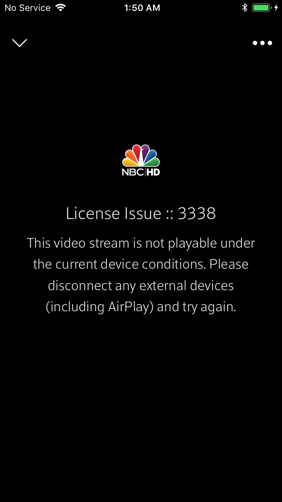
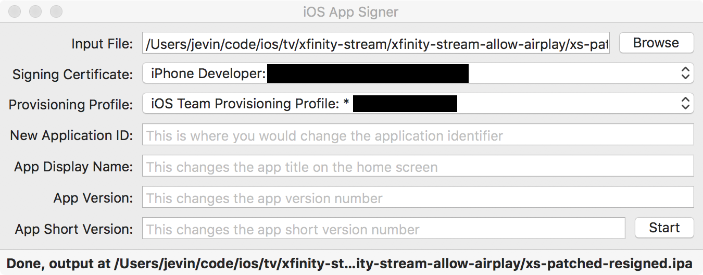
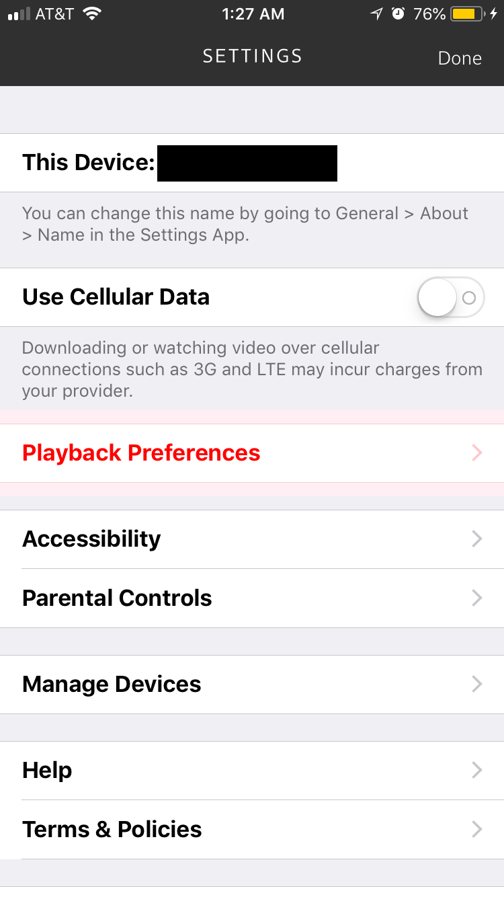
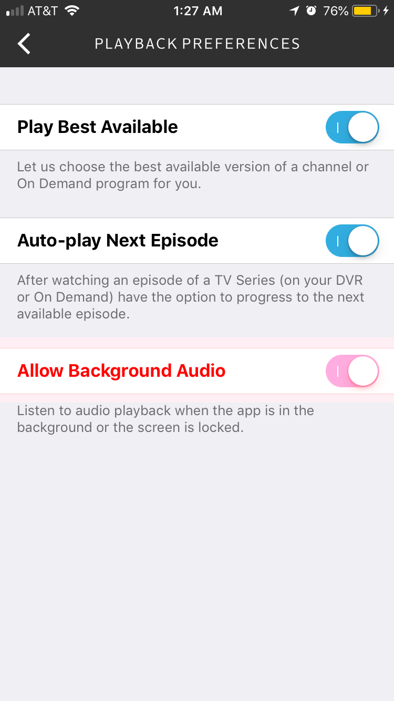

xfinity-stream-allow-airplay
=====================================

Tweak that unlocks AirPlay functionality in the iOS Xfinity Stream app.

Normally the Xfinity Stream app prevents streaming to AirPlay receivers
with an error as seen below:



I wrote this dead simple tweak because I wanted to avoid paying Comcast even more money
to rent another cable box.

Requirements
------------
 * [optool](https://github.com/alexzielenski/optool)
 * [iOS App Signer](https://github.com/DanTheMan827/ios-app-signer)
 * Decryped Xfinity Stream app IPA from a jailbroken device. I used [bfdecrypt](https://github.com/BishopFox/bfdecrypt)
    and [bfinject](https://github.com/BishopFox/bfinject).
 * Paid iOS developer account for resigning. A free account didn't work in my limited testing.

Usage
-----

Place the decrypted IPA at `xs-orig-decrypted.ipa`.

```console
$ make xs-patched-unsigned.ipa
```

Open iOS App Signer and resign the patched IPA:



Now install the patched, resigned IPA to your iDevice.

Open the Xfinity Stream app and login.

Unless you enable background audio in the settings as shown in the following screenshots,
playback will stop once the screen goes to sleep.





Enjoy!
